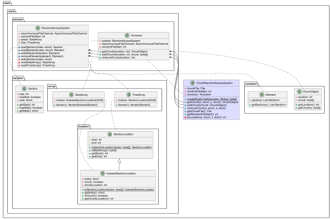

# Who that work

- When file is create it only contain `0xB800` `0x00` (minimum size) (meaning an empty file).  
- When a section is added, the program looks for the first free section in `FREE_ARRAY` (and free section location is replaced by 
`0x0000000000000000`) if it exists, otherwise it simply adds an array of
bytes to the end of the file.
- When a section is deleted his index in `DATA_ARRAY` array is turn to `0x0000` (meaning section is ignored) and a free 
section location is added in `FREE_ARRAY`.

# Project structure

# File structure :

* Array of 2048 sections index (`0x7800` bytes) (`DATA_ARRAY`)
* Array of 2048 free sections location (`0x4000` bytes) (`FREE_ARRAY`)
* All section

# Section index structure

* Section Index :
  * Short : Index of the section
  * Int : Start ; where section start in file
  * Int : End ; where section end in file
  * Byte : IsChunk ; 0x00 if no 0x01 else
  * Int : ChunkLocation ; location of the chunk

# Free section location structure

* Free section location  :
  * Int : Start ; where section start in file
  * Int : End ; where section end in file

# Section structure :

* Section :
  * Array of `n` bytes
  * u1 : Has next tag (0x00 no more section, 0x01 section is not finished)
  * u2 : Next part of section (represent a section index)